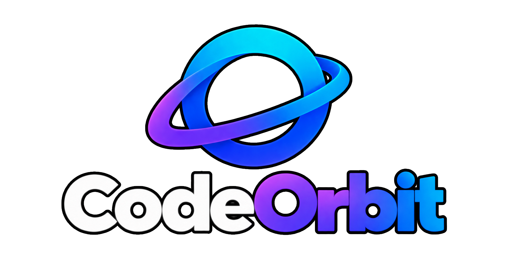
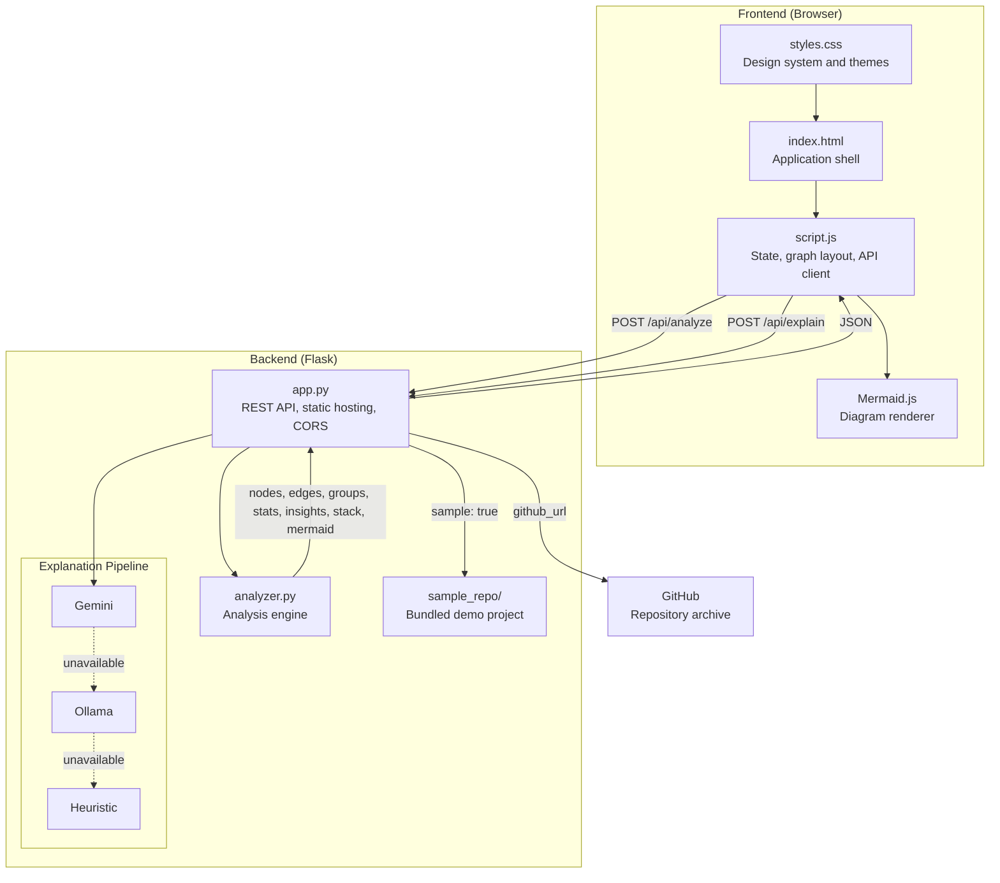
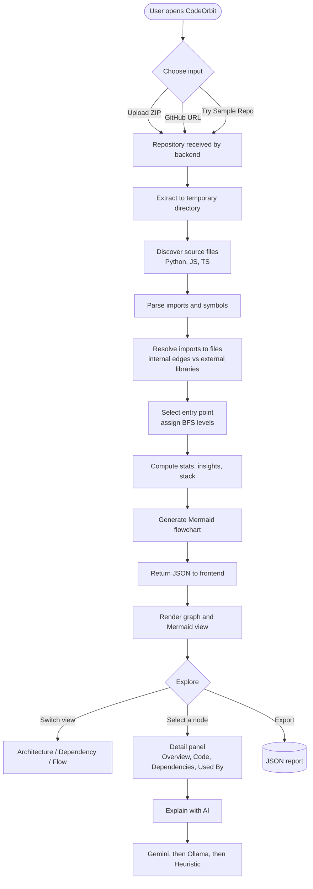

<div align="center">



### Turn Code into Clarity

**An AI-assisted repository architecture visualizer and analyzer.**
Upload a codebase, get an interactive architecture map in seconds.


</div>

---

## Table of Contents

1. [Overview](#overview)
2. [Problem Statement](#problem-statement)
3. [Our Solution and Approach](#our-solution-and-approach)
4. [Key Features](#key-features)
5. [Tech Stack](#tech-stack)
6. [System Architecture](#system-architecture)
7. [Project Flow](#project-flow)
8. [How the Analysis Engine Works](#how-the-analysis-engine-works)
9. [File Structure](#file-structure)
10. [Getting Started](#getting-started)
11. [Configuration](#configuration)
12. [API Reference](#api-reference)
13. [Deployment](#deployment)
14. [Usage Guide](#usage-guide)
15. [Limitations and Roadmap](#limitations-and-roadmap)
16. [Contributing](#contributing)
17. [License](#license)

---

## Overview

CodeOrbit analyzes an existing repository, extracts its file structure and internal dependencies, generates **Mermaid.js** architecture code automatically, and presents the result as an interactive visual model. Developers can explore files, inspect what each file depends on and what depends on it, review project statistics and architectural insights, and request a concise **AI-generated explanation** of any individual component.

Nothing in the visualization is hardcoded: every node, edge, statistic, and diagram is derived from the repository being analyzed.

---

## Problem Statement

**Code-to-Diagram Architecture Visualizer**

Onboarding onto an unfamiliar codebase is slow. Architecture documentation is frequently incomplete, outdated, or absent, so new contributors are forced to reverse-engineer system design by opening files one at a time and tracing imports by hand.

The system must be able to:

- Read a provided repository
- Detect source files and project structure
- Analyze dependencies and relationships between components
- Generate Mermaid.js architecture code automatically
- Render the architecture dynamically
- Allow developers to explore individual files
- Provide AI-powered explanations of selected components

---

## Our Solution and Approach

CodeOrbit models a repository as a **directed graph**: source files are *nodes* and resolved internal imports are *edges*. A Python analysis engine builds the graph; a dependency-free browser frontend renders it.

| Stage | Approach |
|---|---|
| **Ingestion** | Accepts a ZIP upload, a public GitHub repository URL, or a bundled sample repository. GitHub repositories are fetched as an archive of the default branch. |
| **Discovery** | Walks the tree, skipping noise directories (`node_modules`, `venv`, `.git`, `dist`, `build`, `site-packages`, and similar), and collects Python, JavaScript, and TypeScript sources. |
| **Parsing** | Python is parsed with the standard library `ast` module; JavaScript/TypeScript imports and `require()` calls are extracted with pattern matching. |
| **Resolution** | Each import is resolved to a project file using a layered strategy (nearest local path, exact dotted path, shorter dotted paths, unique basename fallback). Unresolved imports are treated as external libraries. |
| **Layering** | An entry point is selected and a breadth-first traversal assigns each file an architectural level. |
| **Generation** | The graph is serialized into a Mermaid `flowchart TD` with a subgraph per folder. |
| **Explanation** | A selected file's metadata and neighbours are sent to an LLM, with graceful fallback so an explanation is always returned. |

**Design principles**

- **Grounded AI.** Prompts contain only analyzer output (file name, path, language, purpose, classes, functions, dependencies, dependents) and instruct the model not to invent implementation details.
- **Always available explanations.** Explanation falls back from Gemini to a local Ollama model to a deterministic heuristic, so the feature works with no API key and no network.
- **Zero-build frontend.** Static HTML, CSS, and vanilla JavaScript. No bundler, no framework.
- **Portable output.** Every analysis can be exported as JSON, and the Mermaid source can be copied straight into documentation.

---

## Key Features

- **Three input modes:** ZIP upload, public GitHub URL, or one-click sample repository
- **Interactive architecture graph** with layered layout, zoom controls, reset, and fullscreen
- **Dependency graph view** showing cross-module relationships only (intra-folder edges are hidden to reduce noise)
- **Live Mermaid.js generation** with rendered preview and one-click code copy
- **File Explorer** with a folder tree and source preview
- **Per-component detail panel** with Overview, Code, Dependencies, and Used By tabs
- **Explain with AI** returning a structured role, purpose, and how-it-fits summary
- **Project statistics:** files, modules, dependencies, and tooling counts
- **Architecture insights:** automatic observations on modularity and connectivity
- **Technology stack detection** from imports (Flask, Django, FastAPI, Express, React, PyTorch, Pandas, and more)
- **Entry point detection** (`main.py`, `app.py`, `index.js`, `server.js`, and others)
- **JSON export** of the full analysis
- **Dark and light themes**, persisted across sessions

---

## Tech Stack

| Layer | Technology |
|---|---|
| **Frontend** | HTML5, CSS3, Vanilla JavaScript (ES6+) |
| **Diagram rendering** | [Mermaid.js v10](https://mermaid.js.org/), custom node layer with SVG connectors |
| **UI assets** | [Lucide](https://lucide.dev/) icons, Inter and JetBrains Mono (Google Fonts) |
| **Backend** | Python, [Flask](https://flask.palletsprojects.com/) 3.x, Flask-CORS |
| **Analysis engine** | Python `ast`, regular expressions, graph traversal (`collections.deque`) |
| **AI providers** | Google Gemini API (primary), Ollama local models (secondary), rule-based heuristic (fallback) |
| **HTTP client** | `requests` (AI calls), `urllib` (GitHub archive download) |
| **Production server** | Gunicorn |
| **Hosting** | GitHub Pages (frontend), Render (backend) |

---

## System Architecture



---

## Project Flow



---

## How the Analysis Engine Works

`backend/analyzer.py` exposes a single entry point, `analyze_repo(root)`, which returns the payload the frontend renders.

**1. Discovery.** Hidden directories and a configurable ignore set are pruned during `os.walk`. Supported extensions are `.py`, `.js`, `.jsx`, `.ts`, `.tsx`.

**2. Metadata extraction.** For every file the engine records path, name, folder group, language, lines of code, a source preview, and a one-line *purpose* taken from the leading docstring or comment. For Python files it also extracts classes and functions through the AST.

**3. Import resolution.** Python imports are resolved in order: nearest local project path, exact dotted module path, progressively shorter dotted paths, then a unique-basename fallback. JavaScript and TypeScript relative imports are resolved to project files. Anything that does not resolve to a project file is classified as an external dependency.

**4. Layering.** The entry point is chosen by known filenames (`main.py`, `app.py`, `index.js`, `server.js`, `app.js`, `index.ts`), then by the presence of `__main__`, then by first file. A BFS from the entry assigns levels; unreachable files are placed on a final level.

**5. Insights and stack.** Modularity and average connectivity checks produce `ok`, `warn`, and `info` insights. Technology stack detection maps imported package names to a curated library table.

**6. Mermaid generation.** Root files become top-level nodes, each folder becomes a `subgraph`, and every resolved dependency becomes an edge.

> Import resolution is heuristic and intended for architecture visualization, not full static analysis.

**Response shape**

```json
{
  "stats":    { "files": 0, "modules": 0, "dependencies": 0, "tools": 0 },
  "nodes":    [ { "id": "", "name": "", "group": "", "level": 0, "purpose": "",
                  "loc": 0, "functions": [], "classes": [], "isEntry": false,
                  "degree": 0, "sourcePreview": "", "lang": "" } ],
  "edges":    [ { "source": "", "target": "" } ],
  "groups":   [],
  "insights": [ { "type": "ok | warn | info", "text": "" } ],
  "stack":    [],
  "mermaid":  "flowchart TD ...",
  "entry":    "",
  "language": ""
}
```

---

## File Structure

```
CodeOrbit/
├── assets/
│   ├── languages/                # Language icons shown in the upload panel
│   └── logo/                     # codeorbit-mark.png, tab_logo.png
├── backend/
│   ├── analyzer.py               # Analysis engine: discovery, parsing, resolution,
│   │                             #   layering, insights, stack detection, Mermaid output
│   ├── app.py                    # Flask app: /api/analyze, /api/explain, static hosting,
│   │                             #   CORS, GitHub archive download, AI fallback chain
│   ├── requirements.txt          # Flask, requests, gunicorn, flask-cors
│   └── sample_repo/              # Bundled Flask demo project (app/, tests/, run.py)
├── index.html                    # Application shell: sidebar, upload panel, workspace
├── script.js                     # Frontend logic: API client, graph layout and rendering,
│                                 #   zoom, file explorer, detail panel, export, themes
├── styles.css                    # Design system with dark and light themes
├── .gitignore
└── README.md
```

---

## Getting Started

### Prerequisites

| Requirement | Version | Purpose |
|---|---|---|
| Python | 3.10 or later | Backend and analysis engine |
| pip | Latest | Installing dependencies |
| Git | Any recent version | Cloning the repository |
| Web browser | Current Chrome, Edge, Firefox, or Safari | Running the frontend |
| Internet access | n/a | Loads Mermaid.js, Lucide, and Google Fonts from CDNs; required for GitHub analysis |
| Gemini API key | Optional | Enables Gemini-powered explanations ([get a key](https://aistudio.google.com/app/apikey)) |
| Ollama | Optional | Enables local-model explanations ([install](https://ollama.com/)) |

### 1. Clone the repository

```bash
git clone https://github.com/Sohan-Malode/CodeOrbit.git
cd CodeOrbit
```

### 2. Create and activate a virtual environment

```bash
cd backend

# macOS / Linux
python3 -m venv venv
source venv/bin/activate

# Windows (PowerShell)
python -m venv venv
venv\Scripts\Activate.ps1
```

### 3. Install dependencies

```bash
python -m pip install -r requirements.txt
```

### 4. (Optional) Enable AI explanations

```bash
# Gemini
export GEMINI_API_KEY="your_api_key_here"          # macOS / Linux
$env:GEMINI_API_KEY="your_api_key_here"            # Windows (PowerShell)

# Ollama (local alternative)
ollama pull qwen2.5-coder:3b
```

CodeOrbit runs fully without either. In that case, explanations are generated by the built-in heuristic.

### 5. Run

```bash
python app.py
```

Open **http://localhost:5000**. The Flask server serves both the API and the frontend, so no separate frontend server is needed.

---

## Configuration

All configuration is through environment variables. Every variable is optional.

| Variable | Default | Description |
|---|---|---|
| `GEMINI_API_KEY` | none | Enables Gemini explanations. Read by the backend only and never exposed to the browser. |
| `GEMINI_MODEL` | see `app.py` | Gemini model used for explanations. |
| `OLLAMA_URL` | `http://localhost:11434/api/generate` | Ollama generate endpoint. |
| `OLLAMA_MODEL` | `qwen2.5-coder:3b` | Ollama model used for explanations. |

> Never commit API keys. `.env` files are already listed in `.gitignore`.

---

## API Reference

Base URL: `http://localhost:5000` for local development.

### `POST /api/analyze`

Analyzes a repository and returns the graph payload described in [How the Analysis Engine Works](#how-the-analysis-engine-works). Three input modes:

| Mode | Content-Type | Body |
|---|---|---|
| ZIP upload | `multipart/form-data` | field `repo`: a `.zip` file |
| GitHub | `application/json` | `{ "github_url": "https://github.com/user/repo" }` |
| Sample | `application/json` | `{ "sample": true }` |

```bash
curl -X POST http://localhost:5000/api/analyze \
  -H "Content-Type: application/json" \
  -d '{"sample": true}'
```

Errors return `{ "error": "<message>" }` with a `4xx` status, for example an invalid archive, an unreachable GitHub repository, or a non-public repository.

### `POST /api/explain`

Returns a structured explanation for one file.

```bash
curl -X POST http://localhost:5000/api/explain \
  -H "Content-Type: application/json" \
  -d '{"file": "app/routes.py"}'
```

```json
{
  "explanation": { "role": "", "purpose": "", "how_it_fits": "" },
  "ai_status": "gemini | not_configured | unavailable | ..."
}
```

Provider order is Gemini, then Ollama, then a deterministic heuristic. `ai_status` reports whether Gemini was used or why it was skipped. The frontend can pass the selected `node` in the request body so explanations still work if the server restarted after analysis.

---

## Deployment

The project is designed for a split deployment.

| Component | Platform | Notes |
|---|---|---|
| Frontend | GitHub Pages | Static files from the repository root. |
| Backend | Render (or any WSGI host) | `gunicorn` is included in `requirements.txt`. |

**Backend start command** (run from `backend/`):

```bash
gunicorn app:app
```

`script.js` selects its API base automatically: `http://127.0.0.1:5000` on localhost, and the configured hosted backend otherwise. If you host your own backend, update `API_BASE_URL` in `script.js` and add your frontend origin to `ALLOWED_ORIGINS` in `backend/app.py`.

---

## Usage Guide

1. **Choose an input:** **Upload ZIP**, **GitHub URL**, or **Try Sample Repo**.
2. **Review the summary:** the project header shows language, file count, modules, and dependency count.
3. **Switch views:** use **Architecture**, **Dependency**, or **Flow (Mermaid)** in the graph toolbar.
4. **Inspect a component:** click any node to open the detail panel (Overview, Code, Dependencies, Used By).
5. **Explain with AI:** click the button for a role, purpose, and architectural fit summary.
6. **Reuse the diagram:** in Flow view, use **Copy code** to paste the Mermaid source into a README or wiki.
7. **Browse files:** open **File Explorer** from the sidebar for the folder tree and source preview.
8. **Export:** click **Export** to download the analysis as `<project>-analysis.json`.

---

## Limitations and Roadmap

**Current limitations**

- **Language coverage:** dependency analysis supports Python, JavaScript, and TypeScript. Other languages are not analyzed.
- **Heuristic resolution:** dynamic imports and runtime wiring are not captured.
- **Public GitHub repositories only.**
- **Single shared analysis state:** the server keeps the most recent analysis in memory for the explain endpoint, so it is designed for single-user or demo use rather than concurrent multi-user sessions.


**Roadmap**

- [ ] Function- and class-level call graphs
- [ ] Per-session analysis state and automatic temp-directory cleanup
- [ ] Upload size limits and archive hardening
- [ ] Private repository support via GitHub tokens
- [ ] Export diagrams as SVG and PNG
- [ ] Additional languages (Java, Go, Rust, C++)
- [ ] Architecture drift detection between commits
- [ ] Docker image for one-command deployment

---

## Contributing

Contributions are welcome.

```bash
git checkout -b feature/your-feature
git commit -m "feat: describe your change"
git push origin feature/your-feature
```

Open a Pull Request describing the change and its motivation.

---

## License

Distributed under the **MIT License**. See [`LICENSE`](LICENSE) for details.

```
MIT License

Copyright (c) 2026 Sohan Malode

Permission is hereby granted, free of charge, to any person obtaining a copy
of this software and associated documentation files (the "Software"), to deal
in the Software without restriction, including without limitation the rights
to use, copy, modify, merge, publish, distribute, sublicense, and/or sell
copies of the Software, and to permit persons to whom the Software is
furnished to do so, subject to the following conditions:

The above copyright notice and this permission notice shall be included in all
copies or substantial portions of the Software.

THE SOFTWARE IS PROVIDED "AS IS", WITHOUT WARRANTY OF ANY KIND, EXPRESS OR
IMPLIED, INCLUDING BUT NOT LIMITED TO THE WARRANTIES OF MERCHANTABILITY,
FITNESS FOR A PARTICULAR PURPOSE AND NONINFRINGEMENT. IN NO EVENT SHALL THE
AUTHORS OR COPYRIGHT HOLDERS BE LIABLE FOR ANY CLAIM, DAMAGES OR OTHER
LIABILITY, WHETHER IN AN ACTION OF CONTRACT, TORT OR OTHERWISE, ARISING FROM,
OUT OF OR IN CONNECTION WITH THE SOFTWARE OR THE USE OR OTHER DEALINGS IN THE
SOFTWARE.
```

---

<div align="center">

**CodeOrbit** · Turn Code into Clarity

</div>